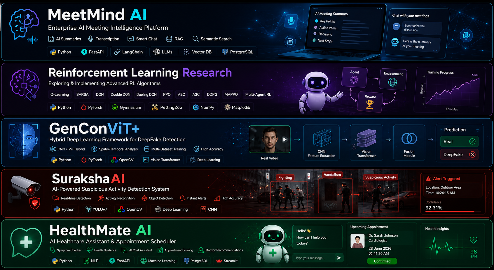
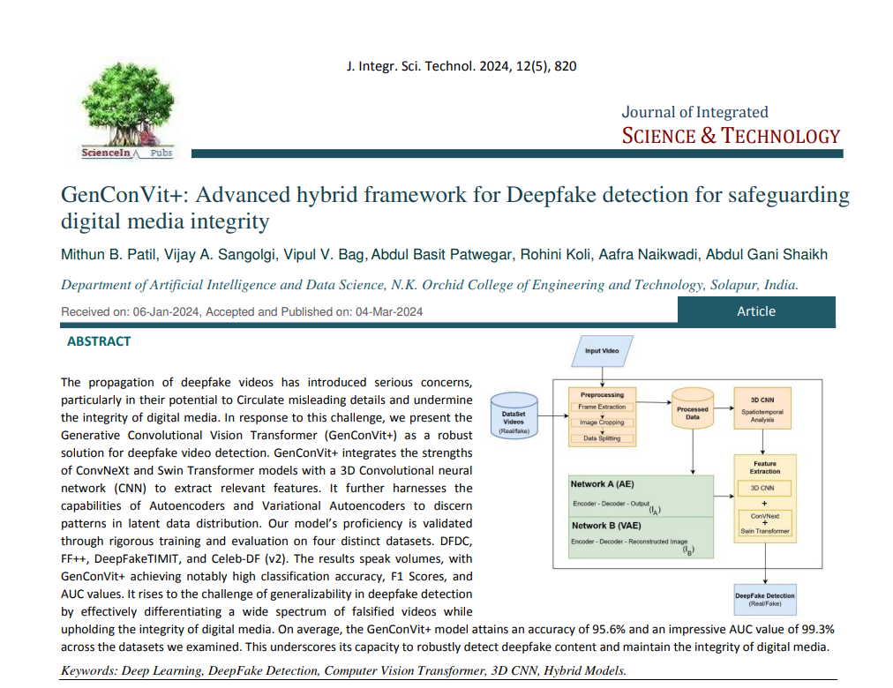
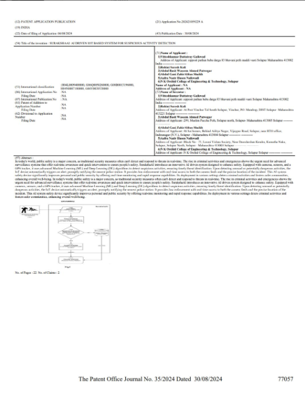

  

<h1 align="center">Hi 👋, I'm Rohini Koli</h1>

<h3 align="center">
AI Engineer | Machine Learning Engineer | M.Tech Student in Data Science
</h3>

  

---

## 👨‍💻 About Me

🎓 **M.Tech Student in Data Science** with a strong foundation in Artificial Intelligence and Data Science.

🤖 Passionate about building intelligent systems using **Machine Learning, Deep Learning, NLP, LLMs, RAG, Computer Vision, and Reinforcement Learning**.

🔬 Interested in solving real-world problems through scalable AI solutions and applied research.

📄 **Published Scopus Indexed Research Paper** in Deep Learning and Computer Vision.

📜 **Published Indian Patent** for an AI-powered Suspicious Activity Detection System.

🚀 Currently exploring **Generative AI, Agentic AI, MLOps, and Production-ready AI Systems**.

💼 Open to **AI Engineer, Machine Learning Engineer, Data Scientist, and Generative AI** opportunities.

---

## 🌱 Currently Working on

- 🤖 Large Language Models (LLMs)
- 🔍 Retrieval-Augmented Generation (RAG)
- 🧠 Agentic AI
- ⚡ MLOps & Model Deployment
- ☁️ Docker & Kubernetes
- 🚀 Scalable AI Applications

---

# 💻 Tech Stack

### 🤖 AI & Generative AI

  
  
  
  
  
  
  
  

---

### ⚡ Frameworks & Libraries

  

---

### 🤗 LLM Ecosystem

  
  
  
  
  
  

---

### 🌐 Backend

  

  
  
  

---

### ⚙️ Tools & DevOps

  

---

### 📊 Data Science

  
  
  
  

---

<h1 align="center">🚀 Featured Projects</h1>

  

  <i>Building AI solutions that solve real-world problems through Machine Learning, Deep Learning, LLMs, RAG, Computer Vision, Reinforcement Learning, and Generative AI.</i>

---

# 📚 Publications

<table>
<tr>
<td width="25%" align="center">

</td>

<td width="75%">

## GenConViT+: A Hybrid Deep Learning Framework for DeepFake Detection

**Journal:** Journal of Integrated Science and Technology (JIST)

**Indexing:** Scopus Indexed

**Research Areas**

`Deep Learning` `Computer Vision` `Vision Transformers` `CNN` `DeepFake Detection`

</td>

</tr>
</table>

---

# 📜 Patent

<table>
<tr>
<td width="25%" align="center">

</td>

<td width="75%">

## SurakshaAI: AI-Powered Suspicious Activity Detection System

**Status:** Published Indian Patent

**Innovation Areas**

`Artificial Intelligence` `Computer Vision` `Deep Learning` `IoT` `Video Analytics`

</td>

</tr>
</table>

# 📈 GitHub Stats

---

# 📫 Connect With Me

📧 Email: kolirohini10@gmail.com

💼 LinkedIn: https://www.linkedin.com/in/rohini-koli-292017212/

🌐 Portfolio: Coming Soon

---

⭐ "Building AI solutions that solve real-world problems."
